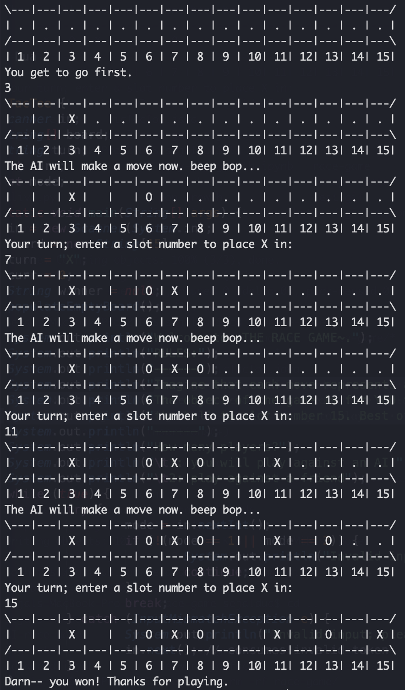
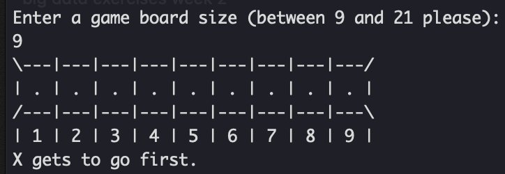

# AI-race-game
A super simple console game with a basic arithmetic pattern. The structure for the code (specifically the game board) was derived from Tic Tac Toe and is implemented with an AI mode!

### Usage

in Terminal (expand as needed):
`git clone https://github.com/sejaldua/AI-race-game.git`

`java RaceGame.java`

### The Race Game

Imagine that each move represents a ball sliding 1, 2, or 3 slots. The object of the game is for YOU to be the one to slide the ball to slot number 15. 

NOTE: There is a pattern. Play the game over and over again until you find it.

### Key Rules
* You can only move 1, 2, or 3 slots forward.
* You cannot move backwards from the current position

### Complete Game Board



### Hours Spent
total: 4
- design: 1
- implementation: 3

### Learning and Takeaways
* This project served as a Java and OOP refresher before I take an AI course taught in Java.
* It was surprisingly easy to implement just because the game is so straightforward. Unlike Tic Tac Toe, there is no way of reaching a "draw" in this game. Also, the game board is in a "winning state" if there is an "X" or an "O" in slot number 15. It is as simple as that.
* As an extension, I would like to implement this game without any hard-coding of numbers. This way, the size of the game board can be adjusted and the AI will still be smart enough to win against a beginner player who does not know the pattern.
* As an exercise, I would like to implement this game in Python to see how difficult it is to port the code and to see if the user experience of playing the game can be improved within a Jupyter Notebook as opposed to the terminal window.

### Extension 1: customizable game board size (removed hard-coding)

The game now asks the user for a game board size:



The AI has also been made far more general to adapt to whatever board size has been selected.

```java
static int smartMove() {
  for (int a = 0; a < (size / 4) + 1; a++) {
    if (curr == (size % 4) + (4*a)) {
      Random rand = new Random(); 
      return (curr + rand.nextInt(3) + 1);
    }
    else if (curr < (size % 4) + (4*a)) {
      return (size % 4) + (4*a);
    }
  }
  return 0;
}
```

